# LAB3_CVDS

## INTEGRANTES 
### - Juan David Zambrano Gonzalez
### - Allan Contreras 


## CREAR PROYECTO CON MAVEN

Creamos el proyecto con Maven usando los parametros solicitados. 

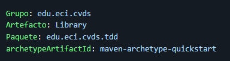

Con el siguiente comando realizamos la creacion del proyecto con los respectivos parametros. 

```mvn archetype:generate -DgroupId=edu.eci.cvds- -DartifactId=Library -DarchetypeArtifactId=maven-archetype-quickstart -DarchetypeVersion=1.5 -DinteractiveMode=false -Dpackage=edu.eci.cvds.tdd```

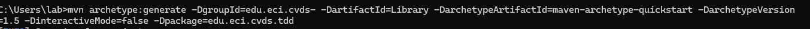


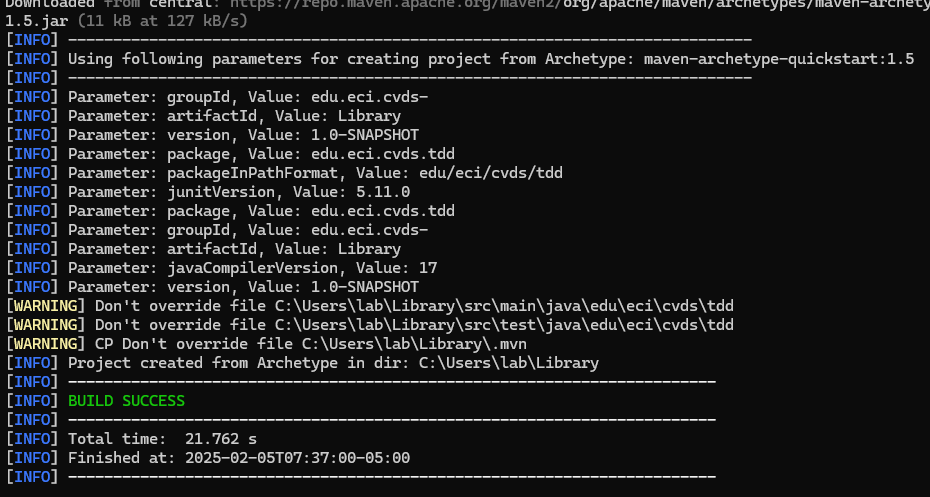

Una vez creado el proyecto verificamos que la estructura sea la esperada usando ```tree```


Compilamos el proyecto para validar que todo este bien.

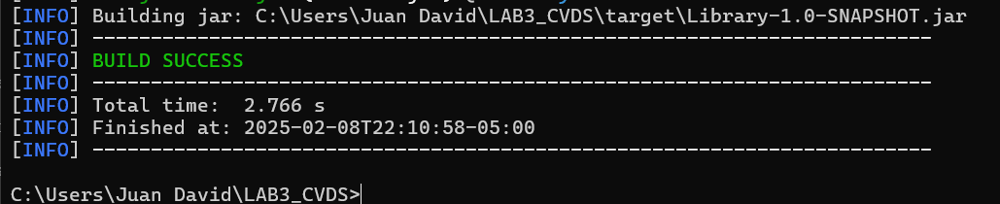

## ESQUELETO DEL PROYECTO

Ahora agregamos el esqueleto del proyecto segun nos lo indica el documento.

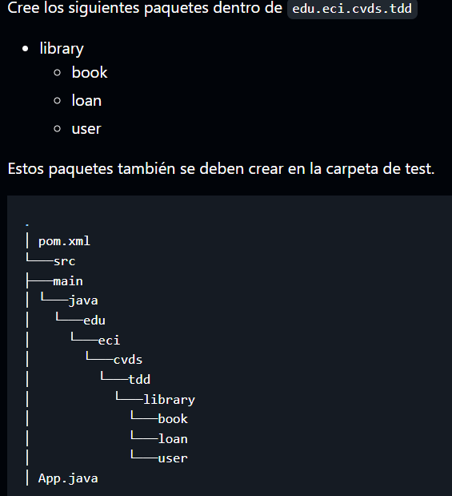

Y usando ```tree``` verificamos que halla quedado bien.

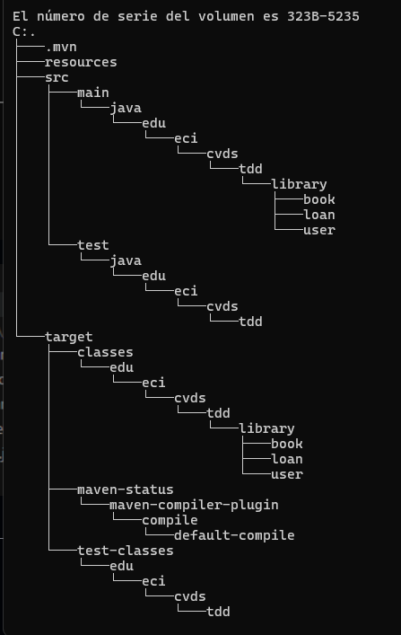


## AGREGAR CLASES

Creamos las clases solicitadas en los paquetes respectivos.  

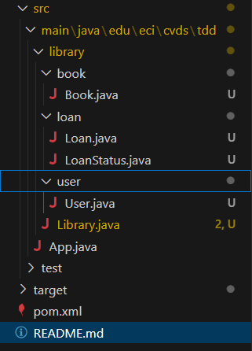

Y comprobamos que la estructura esta bien usando ```mvn clean package```

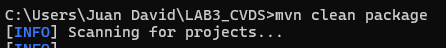

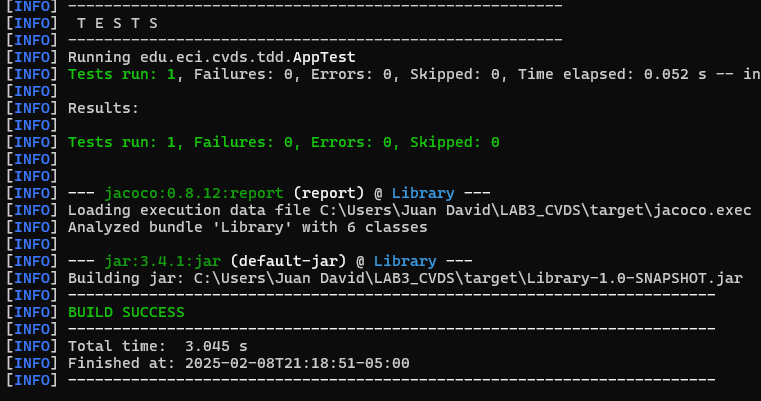

## PRUEBAS UNITARIAS Y TDD

Implementamos el metodo TDD, por lo que para cada metodo realizamos las pruebas necesarias antes de completar el metodo en base a la documentacion proporcionada.

### TEST

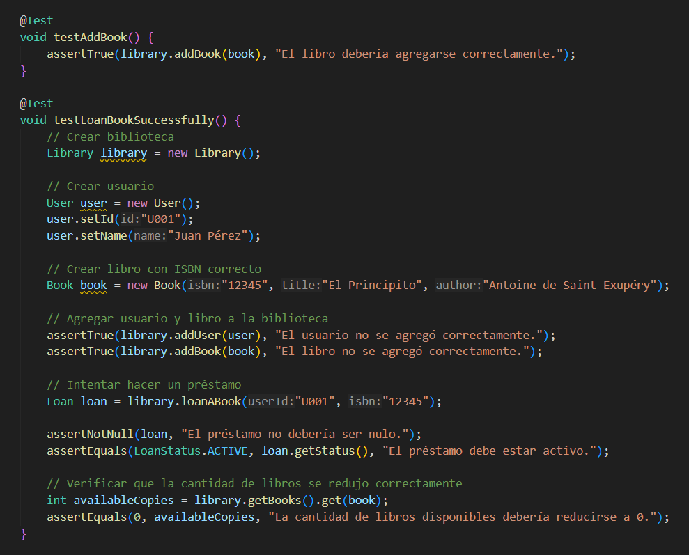

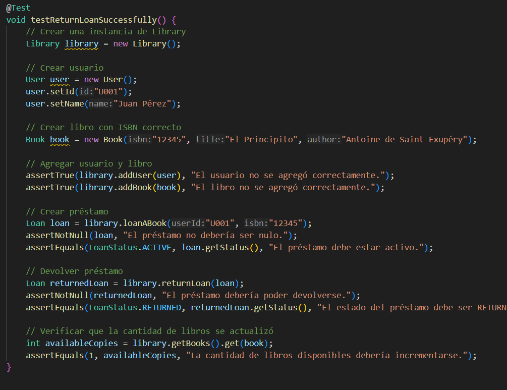

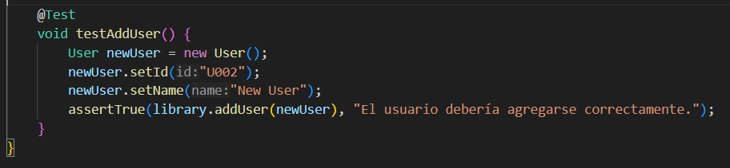


### COBERTURA

Agregamos la dependencia de Jacoco 

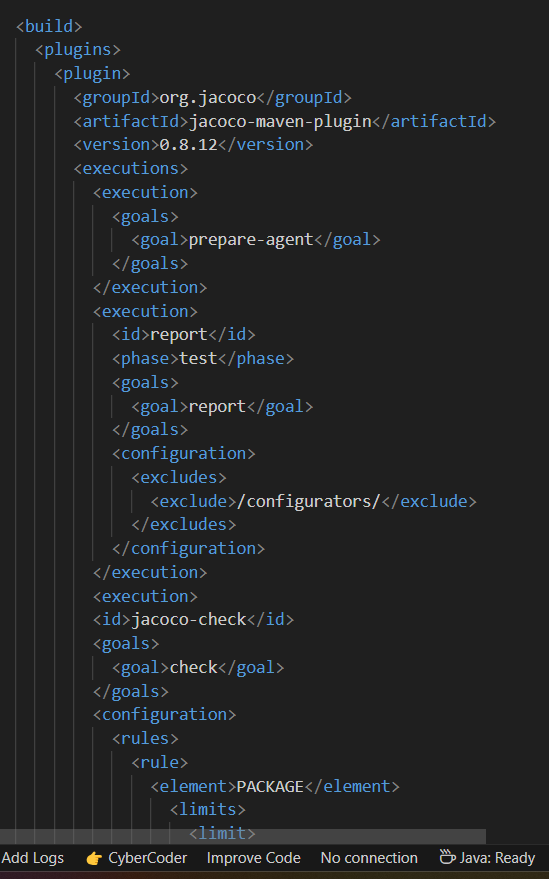

Abrimos el archivo index.html para ver la cobertura inicial del proyecto. 

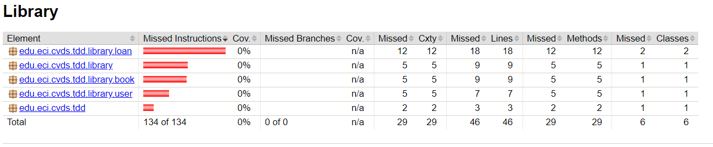

Ahora limpiamos los datos de las compilaciones anteriores con ``` mvn clean```

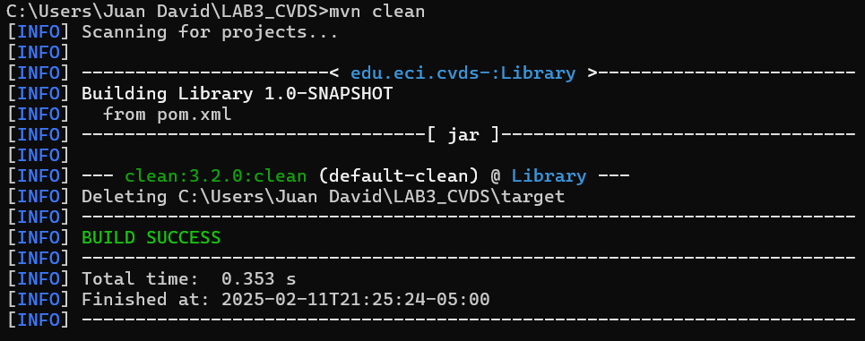

Una vez limpiemos el proyecto ejecutamos las pruebas de nuevo con ```mvn test```

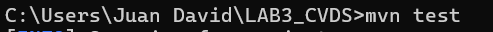

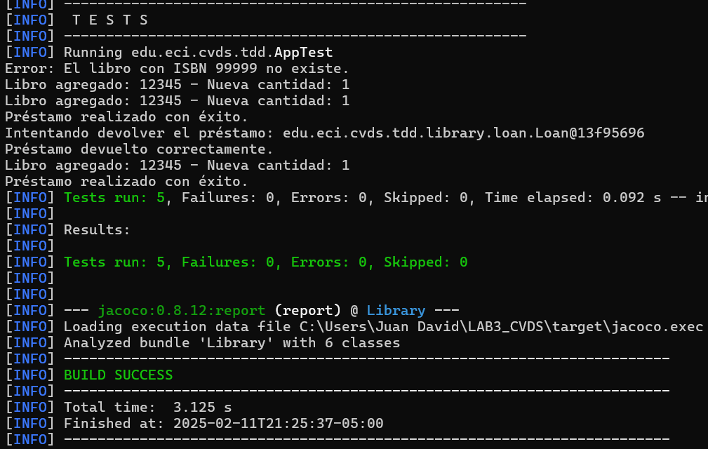

Una vez las pruebas hallan corrido generamos el reporte de jacoco con ```mvn jacoco:report```

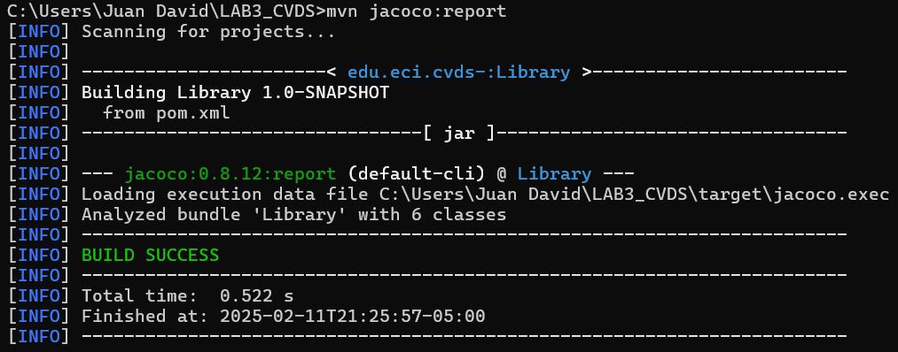


Ahora buscamos el reporte que se encuentra en ```target\site\jacoco``` y es un archivo ```index.html```


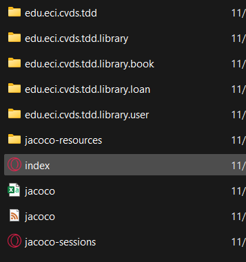

Lo abrimos y miramos el repote de Jacoco actualizado 


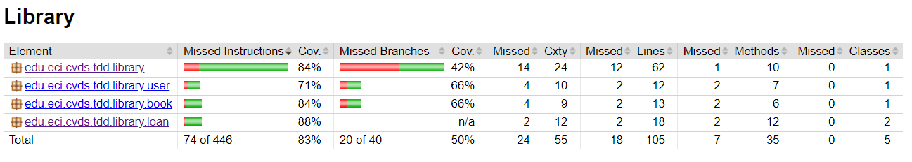

Como podemos ver en el reporte tenemos una covertura total de 83%


## SONARQUBE

descargamos la imagen del docker con el siguiente comando ```docker pull sonarqube```
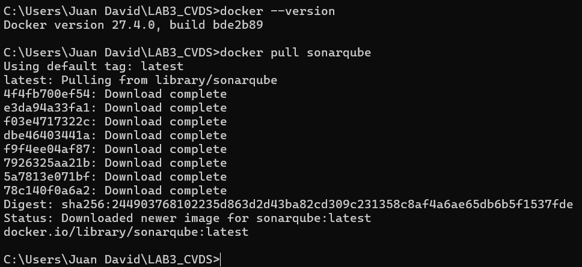

Ahora arrancamos el servicio de SonarQube con el siguiente comando ```docker run -d --name sonarqube -e SONAR_ES_BOOTSTRAP_CHECKS_DISABLE=true -p 9000:9000 sonarqube:latest```

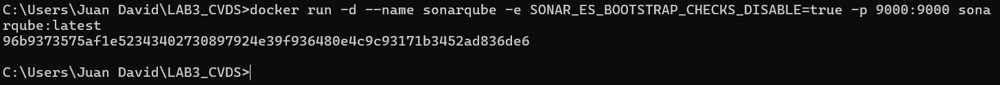

Y validamos el funcionamiento con el comando ```docker ps -a```

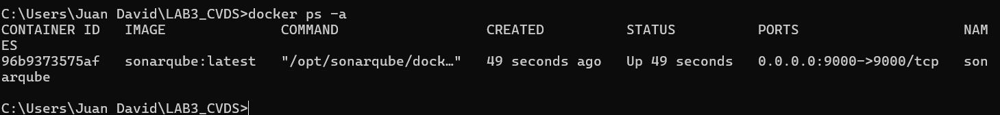

Iniciamos sesión en sonar localhost:9000 y cambiamos la clave por defecto.

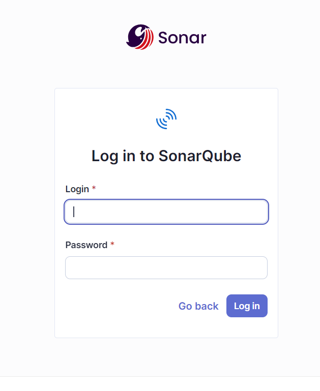

Entramos a las opciones de la cuenta.
Account -> settings -> generate token.
Y generamos un token.

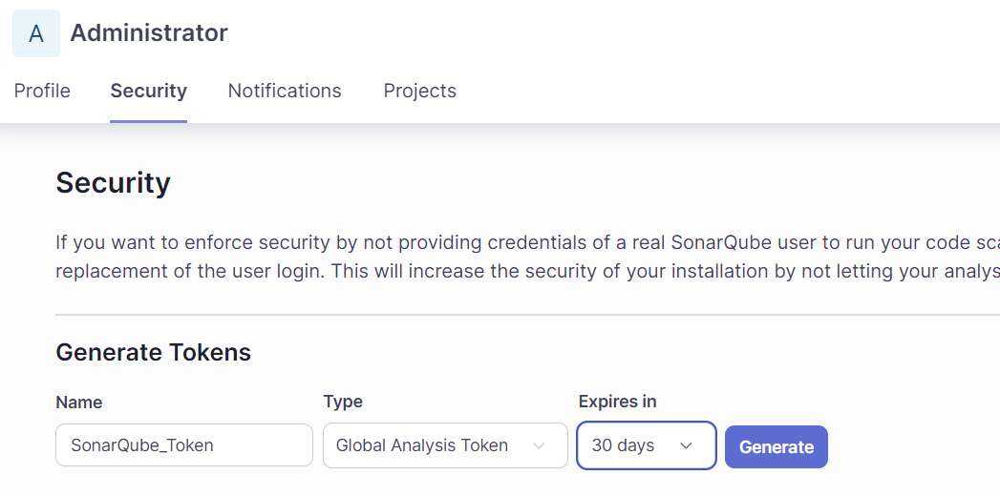

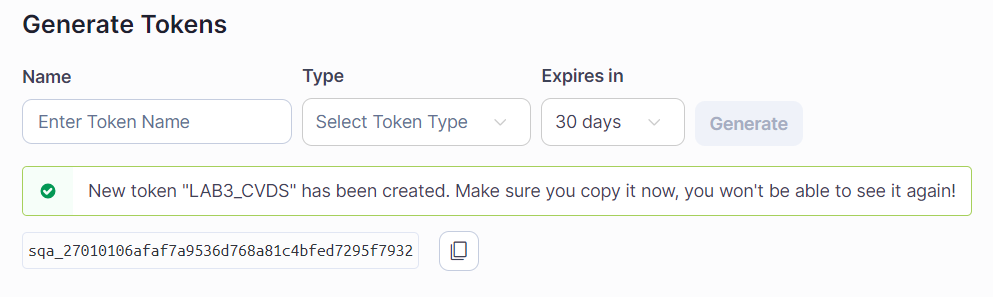

Nuestro token es:

```squ_dc047689f4b24e5fae28bd175e533dce8cf5799d```

Instalamos SonarQube/SonarLint en nuestro IDE en este caso en ```Visual Studio Code```


Añadimos el plugin de Sonar en el archivo pom del proyecto.

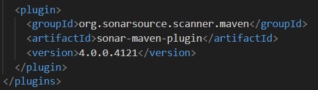

Y añadimos las propiedades de SonarQube y Jacoco.


Una vez completemos lo anterior generamos la integración con sonar ```mvn verify sonar:sonar -D sonar.token=squ_dc047689f4b24e5fae28bd175e533dce8cf5799d```

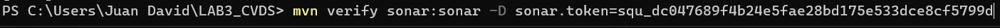

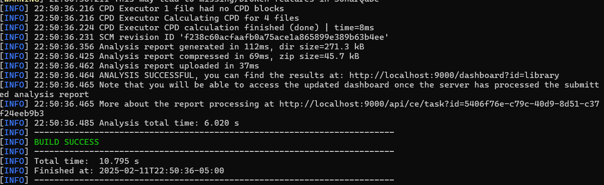

Ahora resta verificar en SonarQube 

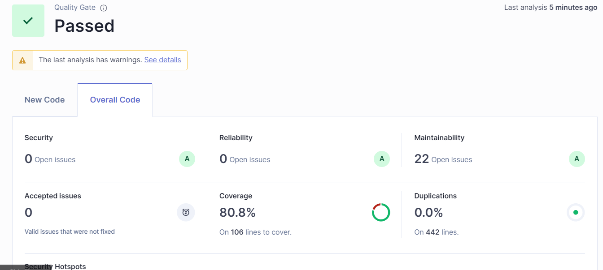