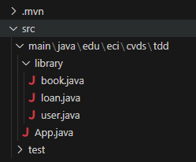

# LAB3_CVDS

## CREAR PROYECTO CON MAVEN

    mvn archetype:generate -DgroupId=edu.eci.cvds- -DartifactId=Library -DarchetypeArtifactId=maven-archetype-quickstart -DarchetypeVersion=1.5 -DinteractiveMode=false -Dpackage=edu.eci.cvds.tdd

