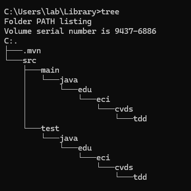

# LAB3_CVDS

## INTEGRANTES 
### - Juan David Zambrano Gonzalez
### - Allan Contreras 


## CREAR PROYECTO CON MAVEN

Creamos el proyecto con Maven usando los parametros solicitados. 


Con el siguiente comando realizamos la creacion del proyecto con los respectivos parametros. 

```mvn archetype:generate -DgroupId=edu.eci.cvds- -DartifactId=Library -DarchetypeArtifactId=maven-archetype-quickstart -DarchetypeVersion=1.5 -DinteractiveMode=false -Dpackage=edu.eci.cvds.tdd```


Una vez creado el proyecto verificamos que la estructura sea la esperada usando ```tree```



Compilamos el proyecto para validar que todo este bien.


## ESQUELETO DEL PROYECTO

Ahora agregamos el esqueleto del proyecto segun nos lo indica el documento.


Y usando ```tree``` verificamos que halla quedado bien.


## AGREGAR CLASES

Creamos las clases solicitadas en los paquetes respectivos.  


Y comprobamos que la estructura esta bien usando ```mvn clean package```


## PRUEBAS UNITARIAS Y TDD


### COBERTURA

Agregamos la dependencia de Jacoco 


Abrimos el archivo index.html para ver la cobertura inicial del proyecto. 


## SONARQUBE

descargamos la imagen del docker con el siguiente comando ```docker pull sonarqube```


Ahora arrancamos el servicio de SonarQube con el siguiente comando ```docker run -d --name sonarqube -e SONAR_ES_BOOTSTRAP_CHECKS_DISABLE=true -p 9000:9000 sonarqube:latest```


Y validamos el funcionamiento con el comando ```docker ps -a```


Iniciamos sesión en sonar localhost:9000 y cambiamos la clave por defecto.


Entramos a las opciones de la cuenta.
Account -> settings -> generate token.
Y generamos un token.


Nuestro token es:

```sqa_d8ca3e33f8faa5f0735ab0edd254f93435105bb9```

Instalamos SonarQube/SonarLint en nuestro IDE en este caso en ```Visual Studio Code```


Añadimos el plugin de Sonar en el archivo pom del proyecto.


Y añadimos las propiedades de SonarQube y Jacoco.


